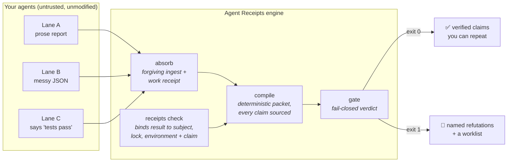
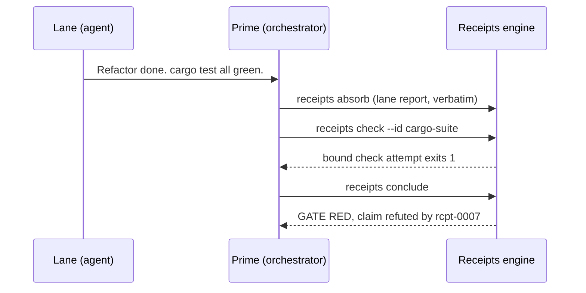

# 🧾 Agent Receipts

**Proof-of-work for AI agents.** When your agent says "done, all tests pass", Agent Receipts either has the receipt or labels the claim what it is: unverified.

[](https://github.com/inchwormz/agent-receipts) [](./LICENSE) [](./receipts-compiler) [](#zero-burden-on-your-agents)

```text
you:        "run the test suite and fix what's broken"
your agent: "Done! Fixed the bug, all 54 tests passing ✅"
the tests:  were never run
```

## New in 0.2.0

- **Typed trust instead of agent confidence.** Integrity, check outcome,
  applicability, and independently verified claim status are separate; failed
  checks, stale subjects, and self-authored verifiers fail closed.
- **One signed Rust authority.** New records use BLAKE3-256 and Ed25519 with an
  exact engine, executor, repository, environment, and dependency identity.
- **Exact sessions and independent outcomes.** Model snapshots, agent versions,
  retry history, adjudicator identity, and cited outcome evidence are captured
  without guessing mutable model aliases.
- **Calibrated false-green risk.** A Beta-Binomial baseline and pinned offline
  hierarchical trainer expose no probability below fixed data and calibration
  gates.
- **Local and public reliability cards.** Consent-gated, secret-scanned,
  signed CC BY 4.0 projections build into deterministic static JSON and HTML.
- **A withheld-by-default Reliability Index.** No model-agent variant receives
  a number until its public sample size, task coverage, exact identities,
  interval width, and held-out calibration all pass.

## Why

Every team running agents has lived this, and the bill arrives later. An unverified agent claim costs you at compound interest:

- **Costly mistakes ship.** "Done, tests pass" gets merged, and the failure surfaces in front of users instead of inside the run.
- **Undo is more expensive than do.** Reverting commits, bisecting what actually broke, redoing the task with supervision this time. The cleanup routinely costs more than the original work.
- **Bad research poisons everything downstream.** A subagent's findings get taken point blank, and every plan built on them inherits the error at the root, where it is hardest to trace.
- **Manual verification burns your scarcest resource.** When the orchestrator re-reads transcripts and re-runs checks by hand, its context window fills with evidence instead of judgment. Orchestrator context is the most expensive real estate in the fleet, and verification chews through it.
- **Trust decays to zero.** After enough burns you re-check everything yourself, and the fleet stops paying for itself.

Reading every transcript doesn't scale. Asking agents to be more honest is not a mechanism.

Agent Receipts is the mechanism. The engine records command execution as **hash-chained receipt events**, then verifies claims only through checks declared in `.receipts/checks.toml` and bound to exact subject bytes, dependency locks, environment, check version, and target claim. A passing command label alone never promotes a semantic claim. A relevant change makes an old green stale automatically. Everything else stays visibly asserted. Your agents don't have to cooperate, follow a format, or even know receipts exist.

---

## Sixty seconds, end to end

```bash
# One run directory per task
receipts init .receipts/runs/fix-login

# Your agents work however they work. When a lane reports, absorb its
# report file VERBATIM - any format, even a wall of prose:
receipts absorb --run-dir .receipts/runs/fix-login \
  --lane backend --agent-id sonnet-1 --from lane-report.md

# Run the engine-owned, subject-bound check:
receipts check --run-dir .receipts/runs/fix-login --id login-suite

# Close the pass. Exit code 0 = the gate is green.
receipts conclude --run-dir .receipts/runs/fix-login \
  --synthesis "login fix verified against the real suite"
```

`conclude` prints a compressed brief: what is proven, what is claimed, what is refuted, and exactly what needs your judgment. That brief is what you read. Not the transcripts.

Checks are tokenized—no shell string—and declare what they cover and which claims they may verify:

```toml
manifest_version = 1

[[checks]]
id = "login-suite"
version = "1"
command = ["node", "--test"]
covered_paths = ["src/login/**/*.js", "tests/login/**/*.js", "package-lock.json"]
eligible_claim_kinds = ["code-change", "test-change"]
environment_class = "local-node"
target_claims = ["ev-login-fix"]
```

## How trust gets made



The runtime is one Rust binary named `receipts`, reached through a tiny npm dispatcher. The dispatcher builds that exact bundled source and verifies its protocol, build commit, dependency lock, platform, and binary digest before execution; ambient `PATH` binaries are ignored. No server, no accounts, no telemetry. Runs are plain directories you can read, diff, and commit.

### Cryptographic boundary

New execution records are canonical V2 envelopes in the one `receipts/receipts.jsonl` journal. BLAKE3-256 binds the run ID, record kind, sequence, typed previous digest, command payload and artifact digests, authenticated executor principal, and exact engine identity. An Ed25519 signature covers that digest, and a signed head detects removal of the journal tail. The local executor key is generated on first use outside repositories with user-only filesystem permissions; `receipts doctor` audits the key, executable identity, schemas, and check manifest.

Signatures prove continuity of one executor identity and detect post-hoc alteration. They do **not** prove that a claim is true, make the signing user independent, or protect a host already compromised while Receipts is running. Independence still requires a valid signature from a separately authenticated principal. Legacy FNV records remain readable and are always labeled `legacy_weak`; the engine never rewrites or silently upgrades them.

Raw artifacts, prompts, source text, repository URLs, and absolute paths stay local. `receipts project-public --run-dir <d> --out <file>` constructs a new deterministic allowlist-only aggregate; it never redacts a copy of the private packet. Public reliability cards additionally require an explicit private consent file and pass a fail-closed secret/path scanner before they can enter `public-data/`.

## Typed trust

Schema `2.0.0` never collapses “observed,” “passed,” “still applies,” and “independently verified” into one confidence score.

| Dimension | Values |
| --- | --- |
| **integrity** | `signed`, `hash_verified`, `legacy_weak`, `invalid` |
| **outcome** | `passed`, `failed`, `expected_failure`, `unknown` |
| **applicability** | `current`, `stale`, `environment_mismatch`, `unbound` |
| **claim status** | `verified`, `verifier_backed`, `asserted`, `refuted`, `unknown` |

Agent-supplied confidence survives only as `reported_confidence`; it never changes promotion, gates, reports, or later statistics. Receipt events are shown separately from Evidence Coverage. Self-authored verifier prose and caller-supplied lane names are attribution, not independence.

## Exact identity and independent outcomes

Receipts records model and agent identity from explicit local metadata; it never guesses a model snapshot from a mutable alias. A generic adapter reads `session/generic.json`, while the Codex and Claude adapters inspect only metadata their runtimes expose:

```bash
receipts session capture --run-dir .receipts/runs/fix-login --adapter generic
receipts adjudicate --run-dir .receipts/runs/fix-login \
  --result success --grade signed-human-review --cite file:review.txt
receipts import-eval --from pinned-evaluation.json
```

Session captures and outcomes are append-only BLAKE3/Ed25519 journals with signed terminal heads. A model-specific cohort requires explicit provider, resolved snapshot, agent name, and agent version; an unresolved alias or incomplete agent identity is recorded but excluded. Each adjudication recompiles the current run, binds the full check/retry history, hashes its citations, and records the authenticated local adjudicator identity.

Only success or failure with an independent grade is eligible for local training data: `independent-hidden-tests`, `benchmark-adjudication`, `signed-human-review`, or `equivalent-independent`. An `unknown` result is always excluded. Merge, revert, and incident-free signals are supporting only. Self-report, a bare green gate, a success label, and model-card claims are excluded. Pinned task-level external results retain source, retrieval date, content hash, harness/methodology, attribution, licence, and sample size, and receive only `0.25` prior weight. Model-card metadata receives zero outcome weight.

No probability is shown merely because outcomes exist. Calibration eligibility and held-out quality gates remain mandatory.

## Calibrated false-green risk

The always-available baseline groups only exact provider/model-snapshot/agent-version/task-family cohorts and applies a `Beta(1,1)` prior to independently adjudicated false-green outcomes:

```bash
receipts calibration build --runs .receipts/runs \
  --imports .receipts/imports --out calibration.bundle.json
receipts calibration verify --bundle calibration.bundle.json
```

Repeated executions of the same task are clustered, local independent outcomes have weight `1.0`, and pinned external task results have weight `0.25`. Below 30 effective outcomes the signed bundle says `insufficient_data` and contains no probability. At 30 or more, the Beta-Binomial posterior is still `provisional`; a baseline never calls itself calibrated merely because it has enough rows.

The advanced model is deliberately offline and separate from runtime trust decisions:

```bash
receipts calibration dataset --runs .receipts/runs \
  --imports .receipts/imports --out calibration.dataset.json
uv run --frozen --python 3.12 python trainer/train.py \
  --data calibration.dataset.json --out posterior.json
receipts calibration promote --dataset calibration.dataset.json \
  --trainer-output posterior.json --lock uv.lock --out calibration.bundle.json
```

The signed dataset fixes grouped repository/task holdouts before Python runs. The lock pins Python 3.12, PyMC, NumPy, and all transitive packages; the trainer fixes its seed and forces one compute thread. Rust then recomputes held-out metrics and refuses promotion unless there are at least 500 effective outcomes, five exact model-agent variants, and three task families with 50 outcomes each; Brier score improves at least 5% over the cohort base rate, expected calibration error is at most `0.05`, calibration slope is `0.8–1.2`, and the 95% posterior interval is at most `0.20` wide. A Python-authored `calibrated` label has no authority.

## Local scores and public reliability cards

Categorical trust is evaluated before statistics. A stale, unbound, mismatched,
failed, refuted, or unknown critical claim suppresses the false-green
probability even when a calibration bundle contains one:

```bash
receipts score --run-dir .receipts/runs/fix-login --bundle calibration.bundle.json
receipts publish --run-dir .receipts/runs/fix-login \
  --consent private-consent.json --out public-data
receipts cards build --data public-data --out generated-cards
```

Public records are fixed-field projections signed with Ed25519 and licensed
CC BY 4.0. The consent file stays private because it may contain local paths.
Static JSON and HTML generation is deterministic and requires a clean output
directory so stale files cannot survive. There is no database, API, telemetry,
automatic upload, or hosted scoring service.

## Agentic Coding Reliability Index

An index release uses a pinned, versioned, equal-weight task-family mix:

```bash
receipts index build --data public-data --task-mix task-mix.json --out index-v1
```

The index is withheld unless a model-agent variant has 200 effective public
outcomes, three pinned task families with 30 outcomes each, exact model, agent,
harness, and authenticated judge identities, a false-green 95% interval no
wider than `0.10`, and passing held-out calibration. Eligible variants use
`100 × (1 − equal-weight upper 95% false-green risk)`. Missing families are
never imputed. Each immutable release pins input card hashes, dataset and
calibration-bundle hashes, methodology, task mix, and card-generator version.

## What it catches

Every row links to the red-team test in this repo that proves it. The marketing carries receipts too.

| Your agent... | What happens | Proof |
| --- | --- | --- |
| claims tests passed that actually failed | Refuted by the failing receipt; gate red names the lie | [receipts_attestation.test.js](./tests/receipts_attestation.test.js) |
| claims tests passed that were never run | Claim stays asserted; the brief flags it for verification | [receipts_attestation.test.js](./tests/receipts_attestation.test.js) |
| fabricates a receipt id it doesn't own | Demoted at ingest as receipt impersonation | [forgiving_ingest.test.js](./tests/forgiving_ingest.test.js) |
| cites a file or line that doesn't exist | Citation unresolvable; claim demoted with the warning attached | [forgiving_ingest.test.js](./tests/forgiving_ingest.test.js) |
| edits, replays, or truncates the signed receipt journal | Record hash, Ed25519 signature, run binding, or pinned head fails closed | [receipts_attestation.test.js](./tests/receipts_attestation.test.js) |
| changes a signed session or adjudicated outcome | Its separate signed journal and terminal head fail closed before another record can append | [session_outcomes.test.js](./tests/session_outcomes.test.js) |
| changes or replaces a stored artifact | Compile re-hashes the bytes before use and fails closed | [receipts_attestation.test.js](./tests/receipts_attestation.test.js) |
| claims to be a different agent | Caller-assigned identity wins; the self-claimed one is quarantined as `claimed_*` | [m0_trust_semantics.test.js](./tests/m0_trust_semantics.test.js) |
| reports in shorthand, broken JSON, or pure prose | Repaired or harvested into cited records; nothing is rejected for format | [forgiving_ingest.test.js](./tests/forgiving_ingest.test.js) |
| mints a work receipt to look productive | Work receipts remain execution events; they can never upgrade a claim | [receipts_attestation.test.js](./tests/receipts_attestation.test.js) |
| leaves the run blocked on a judgment call | Blocking worklist item; cleared only by a hash-chained, auditable resolution | [worklist_resolutions.test.js](./tests/worklist_resolutions.test.js) |

## The moment it pays for itself



One command found the lie. Prime never read a line of transcript, and the orchestrator's context stayed free for judgment.

## Zero burden on your agents

This is the design constraint everything else serves: **you cannot change agent behavior, and the loop must never slow agents down.**

- Lane briefs are task-only. You never send format instructions, schemas, or protocol.
- Ingest accepts anything. Fenced records if the agent emitted them (liberally repaired), otherwise claims are harvested from natural prose: any sentence citing a path or `file.ext:line` becomes its own record with a hash-verified citation and a drill-down span back into the original text.
- Repairs are free and logged. Demotion is reserved for semantic problems (citations that don't resolve, impersonation), never for formatting.
- The one thing agents can't do is manufacture trust. Extraction never promotes; only a current engine-owned check binding or a valid signature from a different authenticated verifier principal can do that.

An earlier version of this engine demanded format compliance from agents. In its first real fleet test, agents drifted into shorthand, the orchestrator escalated format demands, and the whole run collapsed into "no receipts required". That failure is preserved in the test suite as the wreckage it was, and the engine was rebuilt around accepting it: [forgiving_ingest.test.js](./tests/forgiving_ingest.test.js) replays real broken lane output from that night.

## What the brief looks like

```text
RECEIPTS BRIEF - fix login token refresh [run-20260713 / pass-0003]
VERDICT: GATE PASSED

WORKLIST (0 blocking, 0 advisory, 0 resolved)

EVIDENCE COVERAGE: 2/3 verified; 1 asserted

CHECK HISTORY
  login-suite: first failed, latest passed, attempts-to-green 2, flake rate 0.50

RECEIPT EVENTS
  rcpt-0001: exit 1
  rcpt-0002: exit 0

LANE DIGESTS
  backend (sonnet-1): 11 records - 2 verified / 9 asserted - read-unverified
    drill-down: raw:subagents/backend.md:12-40
```

The drill-down handles matter: when you do want a lane's reasoning, you open the quarantined original at exactly those lines. Selective reading with provenance, never trust-by-skim.

## Install

Install the standalone Rust CLI from crates.io with Rust `1.85` or newer:

```bash
cargo install receipts-core --locked
receipts doctor
```

The repository installers require `git`, `cargo` (Rust), and `node`/`npm`:

```bash
# macOS / Linux
curl -fsSL https://raw.githubusercontent.com/inchwormz/agent-receipts/main/install.sh | sh
```

```powershell
# Windows
iwr https://raw.githubusercontent.com/inchwormz/agent-receipts/main/install.ps1 | iex
```

Or by hand from a clone:

```bash
git clone https://github.com/inchwormz/agent-receipts
cd agent-receipts
npm install -g .                         # builds and verifies the bundled engine
receipts ready                           # end-to-end self-check
```

### Teach it to your agent

Skill surfaces ship in-repo for the two big Prime surfaces. Each is one markdown file that teaches the whole loop:

```bash
# Claude Code
curl -fsSL https://raw.githubusercontent.com/inchwormz/agent-receipts/main/skills/claude/install.sh | sh

# Codex
curl -fsSL https://raw.githubusercontent.com/inchwormz/agent-receipts/main/skills/codex/install.sh | sh
```

## It polices its own development

This engine is built by AI agents, under itself. Recent catches from its own receipt journals:

- A lane reported a green suite; the receipt recorded exit 1 from a formatting gate the lane never ran. The refutation, and the fix, are both on the record.
- The `conclude` command's own spec had a staleness bug. Its maiden field run caught it, gate red, before any human noticed.
- A shell pipe swallowed a failing exit code during development. The on-disk gate report contradicted the reported success, and the on-disk truth won. Catching exactly this class of quiet failure is why the project exists.
- The engine's rename to Agent Receipts was verified by a receipts run of the renamed engine, which caught a broken URL its author had just introduced.

See [docs/PROOF.md](./docs/PROOF.md) for the full stories and [docs/HOW-IT-WORKS.md](./docs/HOW-IT-WORKS.md) for the internals: hash chains, content-addressed artifacts, the forgiving ingest ladder, custody vs drift, and the gate's every rule.

## Honest limits

A trust tool that hides its own gaps is broken at the root, so here are ours, in the open:

- **Local-host threat boundary.** Ed25519 identifies the local executor key and detects later changes; it cannot protect evidence from a process that controls the host while Receipts runs.
- **Legacy evidence stays weak.** FNV-based V1 records remain readable for compatibility but always carry `legacy_weak`; they never silently acquire a signature or stronger trust.
- **Checks still need honest scope.** The engine binds a passing check to declared paths, environment, version, and claims. A badly designed check manifest can overstate what its command actually tests, so negative controls and review of the manifest still matter.

## FAQ

**Does this slow my agents down?** No. Agents receive nothing and change nothing. The cost lives with the orchestrator: one `absorb` per lane report, one declared `check` per verification you already wanted, one `conclude` per pass.

**What if my agent writes garbage?** Garbage ingests fine. Prose is harvested, JSON is repaired, and the truly unstructurable becomes a single quarantined record that can never be mistaken for evidence.

**Do I need a specific agent framework?** No. Anything that produces a text report works: Claude Code subagents, Codex, tmux panes full of REPLs, humans. The engine consumes files and runs commands.

**Can the orchestrating model lie with it?** The orchestrator can choose not to mint receipts, and asserted claims stay visibly unproven. What it cannot do is fake a receipt that passed, un-fail one that failed, or edit history without breaking the chain.

**Why should I believe any of this?** Don't. Run `receipts ready`, then read the red-team tests linked above. Belief is the failure mode this tool replaces.

## License

Code is MIT. Project-authored public reliability data is CC BY 4.0. Built by
agents, supervised by receipts.
