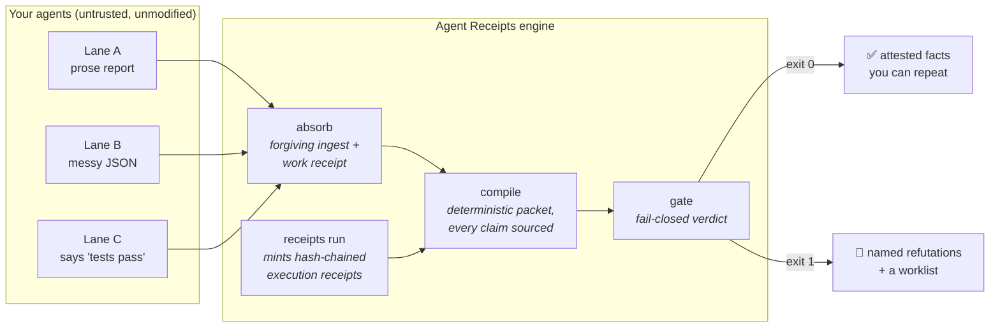
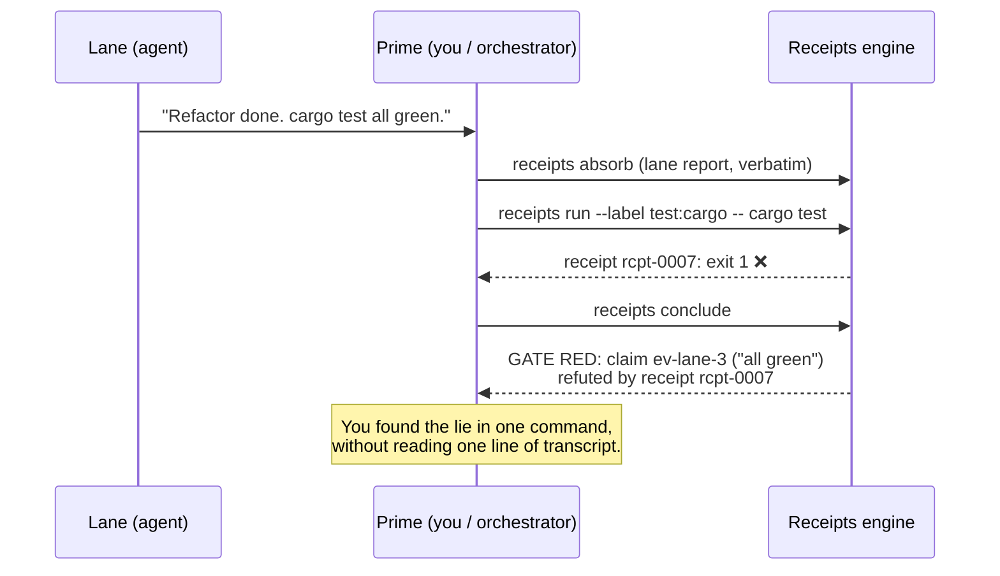

# 🧾 Agent Receipts

**Proof-of-work for AI agents.** When your agent says "done, all tests pass", Agent Receipts either has the receipt or labels the claim what it is: unverified.

[](./LICENSE) [](./receipts-compiler) [](#zero-burden-on-your-agents)

```text
you:        "run the test suite and fix what's broken"
your agent: "Done! Fixed the bug, all 54 tests passing ✅"
the tests:  were never run
```

Every team running coding agents has lived this. Agents report success at the rate you reward it. Reading every transcript doesn't scale, and asking agents to be more honest is not a mechanism.

Agent Receipts is the mechanism. The orchestrator mints **hash-chained execution receipts** for every command that matters. Claims that cite a passing receipt get promoted to **attested facts**. Claims contradicted by a failing receipt are **mechanically refuted** and the run goes red. Everything else stays labeled as hearsay. Your agents don't have to cooperate, follow a format, or even know receipts exist.

---

## Sixty seconds, end to end

```bash
# One run directory per task
receipts init .receipts/runs/fix-login

# Your agents work however they work. When a lane reports, absorb its
# report file VERBATIM - any format, even a wall of prose:
receipts absorb --run-dir .receipts/runs/fix-login \
  --lane backend --agent-id sonnet-1 --from lane-report.md

# Never trust "tests pass". Mint the proof yourself:
receipts run --run-dir .receipts/runs/fix-login \
  --label test:suite -- npm test

# Close the pass. Exit code 0 = the gate is green.
receipts conclude --run-dir .receipts/runs/fix-login \
  --synthesis "login fix verified against the real suite"
```

`conclude` prints a compressed brief: what is proven, what is claimed, what is refuted, and exactly what needs your judgment. That brief is what you read. Not the transcripts.

## How trust gets made



The engine is two small binaries: `receipts-core` (Rust, deterministic compiler and receipt journal) and `receipts` (Node CLI, the one command you use). No server, no accounts, no telemetry. Runs are plain directories you can read, diff, and commit.

## The trust ladder

Every statement in a run lands on exactly one rung, and the report never lets a lower rung dress up as a higher one.

| Tier | Meaning | Who can create it |
| --- | --- | --- |
| **attested** | The runtime watched it happen. Receipt-backed: command, exit code, hashed output, tree state. | Only the runtime. Agents cannot mint, forge, or edit receipts. |
| **verifier** | A verifier lane checked it and its finding passed the gate's provenance rules. | Verifier lanes, with citations. |
| **asserted** | A load-bearing claim ("I changed X", "root cause is Y") with no proof yet. Listed, never trusted. | Any agent. |
| **narrative** | Prose that mentions files without claiming anything checkable. Indexed for drill-down. | Any agent. |

When your agent's "all tests pass" cites the label `test:suite` and your receipt for `test:suite` shows exit 0, the claim climbs to attested. When your receipt shows exit 1, the claim is refuted by name and the gate goes red. When there is no receipt at all, the claim sits at asserted, visibly, until you mint one.

## What it catches

Every row links to the red-team test in this repo that proves it. The marketing carries receipts too.

| Your agent... | What happens | Proof |
| --- | --- | --- |
| claims tests passed that actually failed | Refuted by the failing receipt; gate red names the lie | [receipts_attestation.test.js](./tests/receipts_attestation.test.js) |
| claims tests passed that were never run | Claim stays asserted; the brief flags it for verification | [receipts_attestation.test.js](./tests/receipts_attestation.test.js) |
| fabricates a receipt id it doesn't own | Demoted at ingest as receipt impersonation | [forgiving_ingest.test.js](./tests/forgiving_ingest.test.js) |
| cites a file or line that doesn't exist | Citation unresolvable; claim demoted with the warning attached | [forgiving_ingest.test.js](./tests/forgiving_ingest.test.js) |
| edits the receipt journal after the fact | Hash chain breaks; compile fails fatally | [receipts.rs tests](./receipts-compiler/src/compiler/receipts.rs) |
| tries to overwrite a stored artifact | Content-address collision with different bytes is a hard error | [receipts.rs tests](./receipts-compiler/src/compiler/receipts.rs) |
| claims to be a different agent | Caller-assigned identity wins; the self-claimed one is quarantined as `claimed_*` | [m0_trust_semantics.test.js](./tests/m0_trust_semantics.test.js) |
| reports in shorthand, broken JSON, or pure prose | Repaired or harvested into cited records; nothing is rejected for format | [forgiving_ingest.test.js](./tests/forgiving_ingest.test.js) |
| mints a work receipt to look productive | Work receipts attest tree state only; they can never upgrade a claim | [receipts_attestation.test.js](./tests/receipts_attestation.test.js) |
| leaves the run blocked on a judgment call | Blocking worklist item; cleared only by a hash-chained, auditable resolution | [worklist_resolutions.test.js](./tests/worklist_resolutions.test.js) |

## The moment it pays for itself



## Zero burden on your agents

This is the design constraint everything else serves: **you cannot change agent behavior, and the loop must never slow agents down.**

- Lane briefs are task-only. You never send format instructions, schemas, or protocol.
- Ingest accepts anything. Fenced records if the agent emitted them (liberally repaired), otherwise claims are harvested from natural prose: any sentence citing a path or `file.ext:line` becomes its own record with a hash-verified citation and a drill-down span back into the original text.
- Repairs are free and logged. Demotion is reserved for semantic problems (citations that don't resolve, impersonation), never for formatting.
- The one thing agents can't do is manufacture trust. Extraction never promotes; only receipts and gated verifier findings do.

An earlier version of this engine demanded format compliance from agents. In its first real fleet test, agents drifted into shorthand, the orchestrator escalated format demands, and the whole run collapsed into "no receipts required". That failure is preserved in the test suite as the wreckage it was, and the engine was rebuilt around accepting it: [forgiving_ingest.test.js](./tests/forgiving_ingest.test.js) replays real broken lane output from that night.

## What the brief looks like

```text
RECEIPTS BRIEF - fix login token refresh [run-20260713 / pass-0003]
VERDICT: GATE PASSED

WORKLIST (0 blocking, 0 advisory, 0 resolved)

TRUSTED FACTS (4 attested, 0 verifier)
  [attested] receipts run: `npm test` exited 0 in 6281ms [attests test:suite]
  [attested] receipts run: `cargo test` exited 0 in 941ms [attests test:cargo]
  [attested] work: 9 files changed +214/-38 in window rcpt-0001..rcpt-0003

LANE DIGESTS
  backend (sonnet-1): 11 records - 2 attested / 9 narrative - read-unverified
    drill-down: raw:subagents/backend.md:12-40
```

The drill-down handles matter: when you do want a lane's reasoning, you open the quarantined original at exactly those lines. Selective reading with provenance, never trust-by-skim.

## Install

Requires `git`, `cargo` (Rust), and `node`/`npm`.

```bash
# macOS / Linux
curl -fsSL https://raw.githubusercontent.com/inchwormz/agent-receipts/main/install.sh | sh
```

```powershell
# Windows
iwr https://raw.githubusercontent.com/inchwormz/agent-receipts/main/install.ps1 | iex
```

Or by hand from a clone:

```bash
git clone https://github.com/inchwormz/agent-receipts
cd agent-receipts
cargo install --path receipts-compiler   # the receipts-core engine
npm install -g .                         # the `receipts` CLI
receipts ready                           # end-to-end self-check
```

### Teach it to your agent

Skill surfaces ship in-repo for the two big Prime surfaces. Each is one markdown file that teaches the whole loop:

```bash
# Claude Code
curl -fsSL https://raw.githubusercontent.com/inchwormz/agent-receipts/main/skills/claude/install.sh | sh

# Codex
curl -fsSL https://raw.githubusercontent.com/inchwormz/agent-receipts/main/skills/codex/install.sh | sh
```

## It polices its own development

This engine is built by AI agents, under itself. Recent catches from its own receipt journals:

- A lane reported a green suite; the receipt recorded exit 1 from a formatting gate the lane never ran. The refutation, and the fix, are both on the record.
- The `conclude` command's own spec had a staleness bug. Its maiden field run caught it, gate red, before any human noticed.
- A shell pipe swallowed a failing exit code during development. The on-disk gate report contradicted the reported success, and the on-disk truth won. Catching exactly this class of quiet failure is why the project exists.
- The engine's rename to Agent Receipts was verified by a receipts run of the renamed engine, which caught a broken URL its author had just introduced.

See [docs/PROOF.md](./docs/PROOF.md) for the full stories and [docs/HOW-IT-WORKS.md](./docs/HOW-IT-WORKS.md) for the internals: hash chains, content-addressed artifacts, the forgiving ingest ladder, custody vs drift, and the gate's every rule.

## Honest limits

A trust tool that hides its own gaps is broken at the root, so here are ours, in the open:

- **Single-operator threat model.** Receipts prove what ran on your machine under your account. Any process on the box can mint receipts; per-principal signing and executor binding are on the roadmap, in that order.
- **The hash chain uses fnv1a-64.** Tamper-evident against accident and casual meddling, and fast. It is not cryptographic; BLAKE3 signing is the planned upgrade.
- **A passing label attests one thing**: that exact command exited 0. It does not prove the command semantically covers the claim citing it. Choosing the right command is still your judgment.

## FAQ

**Does this slow my agents down?** No. Agents receive nothing and change nothing. The cost lives with the orchestrator: one `absorb` per lane report, one `run` per check you already wanted proof of, one `conclude` per pass.

**What if my agent writes garbage?** Garbage ingests fine. Prose is harvested, JSON is repaired, and the truly unstructurable becomes a single quarantined record that can never be mistaken for evidence.

**Do I need a specific agent framework?** No. Anything that produces a text report works: Claude Code subagents, Codex, tmux panes full of REPLs, humans. The engine consumes files and runs commands.

**Can the orchestrating model lie with it?** The orchestrator can choose not to mint receipts, and asserted claims stay visibly unproven. What it cannot do is fake a receipt that passed, un-fail one that failed, or edit history without breaking the chain.

**Why should I believe any of this?** Don't. Run `receipts ready`, then read the red-team tests linked above. Belief is the failure mode this tool replaces.

## License

MIT. Built by agents, supervised by receipts.
