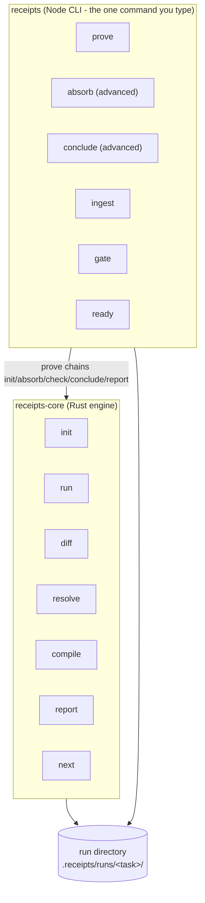
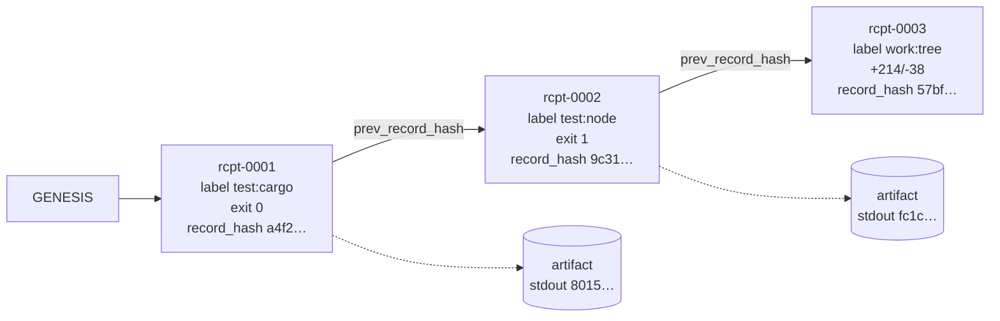

# How Agent Receipts works

This is the internals tour. If you haven't read the [README](../README.md), start there; this page assumes you know what the loop is for.

## Architecture

Two artifacts, installed once, with one safe orchestration command.



Everything lives in the run directory. There is no daemon, no database, no network. You can `cat` every artifact, and you can commit a run directory to git as a permanent record.

```text
.receipts/runs/<task>/
├── manifest.json            # objective, run/pass ids, repo_root (what citations verify against)
├── briefs/                  # what you sent the lanes (task-only, by doctrine)
├── raw/subagents/           # lane reports, quarantined VERBATIM, hashed
├── worker-results/          # evidence.jsonl - structured records after ingest
├── verifier-results/        # findings.jsonl - verifier lane findings
├── receipts/
│   ├── receipts.jsonl       # hash-chained execution + work receipts (runtime-only)
│   └── artifacts/           # content-addressed stdout/stderr/diff blobs
├── decisions/
│   └── resolutions.jsonl    # hash-chained adjudications (Prime-only)
└── state/
    ├── next_pass_packet.json  # the compiled, deterministic truth packet
    ├── gate-report.json       # the verdict
    └── report.html            # human-readable report
```

## Execution receipts

`receipts run --run-dir <d> --label test:suite -- npm test` is a low-level
execution recorder. It does four things:

1. Records repo tree state (git HEAD + dirty file hash) before and after.
2. Executes the command exactly as given, streaming stdout/stderr to content-addressed artifact files (`artifacts/<fnv1a-64>.txt`).
3. Appends one receipt record to `receipts.jsonl`, chained to the previous record's hash.
4. Propagates the child's exit code, so your shell logic keeps working.



Each record's `record_hash` covers the serialized record minus itself; each record embeds the previous hash. Edit anything in the middle and every subsequent record fails verification: the compile aborts with a tamper error. Artifacts are content-addressed, and writing different bytes to an existing address is a hard error (no squatting).

**Work receipts** (`receipts diff`, minted automatically by `absorb`) carry the reserved label `work:tree` and record what changed on disk: numstat summary, mechanical windows between receipt ids. They attest tree state and are deliberately invisible to claim attestation. A lane cannot earn trust by diffing.

Its passing exit code proves only that this exact command execution returned
zero. It never promotes a semantic claim. Use a repo-declared `receipts check`,
or the default `receipts prove` chain, for subject- and claim-bound proof.

## Attestation and refutation

At compile time, the engine verifies check attempts against their signed
receipts and current manifest definition.

- A current passing declared check can attest only its exact `target_claims` and eligible claim kinds.
- A failed declared check refutes a matching success claim and turns the safe path red.
- Subject, dependency lock, environment, command, or check-definition drift makes an old pass stale.
- Raw `run` labels and fabricated receipt references remain execution events; they cannot promote semantic claims.
- Claims without a current check binding stay **asserted**. `prove` additionally refuses exit 0 when the total bound claim count is zero.

## Forgiving ingest: the repair ladder

Lanes owe you nothing. Ingest climbs down this ladder until something sticks, logging every repair:

1. **Fenced records** - ```receipts-evidence-jsonl blocks (legacy `mythos-*` labels accepted forever). Fence variants, single-backtick labels, and label-only markers all count.
2. **JSON repair** - trailing commas, unquoted keys, pretty-printed arrays, field aliases (`summary`/`text`/`claim`...), per-record salvage when one line in a block is broken.
3. **Prose harvesting** - sentences citing a concrete path or `file.ext:line` become individual records, each with a hash-verified citation into the quarantined original and a line-span drill-down id (`raw:subagents/lane.md:12-40`).
4. **Unstructured fallback** - anything left becomes one quarantined record that is excluded from facts by construction.

The split that keeps this honest: **format problems are repaired for free; semantic problems demote.** A claim citing a file that doesn't resolve, impersonating a receipt, or claiming another agent's identity gets a provenance warning and drops out of fact eligibility. A demoted record is also exempt from further gate punishment for the same offense (demotion is the penalty, not the first strike).

## Worklist and resolutions

The compiler is the single author of the worklist. Items are typed and either blocking or advisory:

| Category | Trigger | Blocking? |
| --- | --- | --- |
| `adjudicate` | receipt refutations, contradictions | refutations always; others by severity |
| `unblock` | a lane wrote `BLOCKED <reason>` | yes |
| `resolve-finding` | a verifier finding didn't pass | yes |
| `verify-claim` | load-bearing asserted claim, no proof | advisory, requiring a declared check binding |
| `re-task-or-accept` | a lane produced only unstructured output | advisory |

Blocking items are cleared only by `receipts resolve`, which appends to a second hash-chained journal (`decisions/resolutions.jsonl`). Judgment calls are allowed; invisible judgment calls are not. The deadlock circuit (blocked lane, red gate, resolve, green gate) is a test, not a promise: [worklist_resolutions.test.js](../tests/worklist_resolutions.test.js).

## Custody vs drift

Two different problems, two different severities:

- **Custody** - files inside the run directory changing after quarantine (a lane report edited after ingest). Hash mismatch inside the run dir is fatal. Nobody rewrites history.
- **Drift** - the repo tree moving on after review (you fixed things; the citations now point at changed lines). This is a warning with a count, because post-review fixes are the normal, healthy case.

## The gate

`receipts prove` is the safe default: it chains ingest, all declared checks,
conclusion, and reporting, and additionally requires at least one bound claim.
The granular `receipts conclude` (or `receipts gate`) remains fail-closed on the
categorical gate rules below:

1. Inputs are fresh (the packet fingerprint matches the raw/receipts/decisions files on disk).
2. Schema versions are known; unknown versions fail, they don't warn.
3. Enough distinct agents contributed substantive evidence (`RECEIPTS_MIN_AGENT_COVERAGE`, default 3 - set it explicitly for small runs and say so).
4. Every trusted fact traces to registered sources with hashes.
5. No summary-only load-bearing claims dressed up as sourced ones.
6. No machine-specific absolute paths leaking into portable records.
7. No unresolved blocking worklist items.
8. No `con:receipt:*` refutations. Ever.
9. Raw-span citations must land inside the quarantined file they cite.

The verdict lands in `state/gate-report.json`, the human story in `state/report.html`, and the compressed brief on your terminal via `receipts next`.

## Determinism

Compiling the same run directory twice yields byte-identical packets ([compile_determinism.rs](../receipts-compiler/tests/compile_determinism.rs)). No timestamps are invented at compile time, ids are content-derived, and ordering is total. Determinism is what makes the packet a record instead of an impression.

## Schema and compatibility

Packets carry `schema_version` (currently 1.2.0; 1.1.0 reads as legacy with conservative defaults). The receipt record shape is frozen and canary-tested: extending it would change the hash preimage and make older verifiers report false tampering, so extensions go in artifacts, never in the record.
